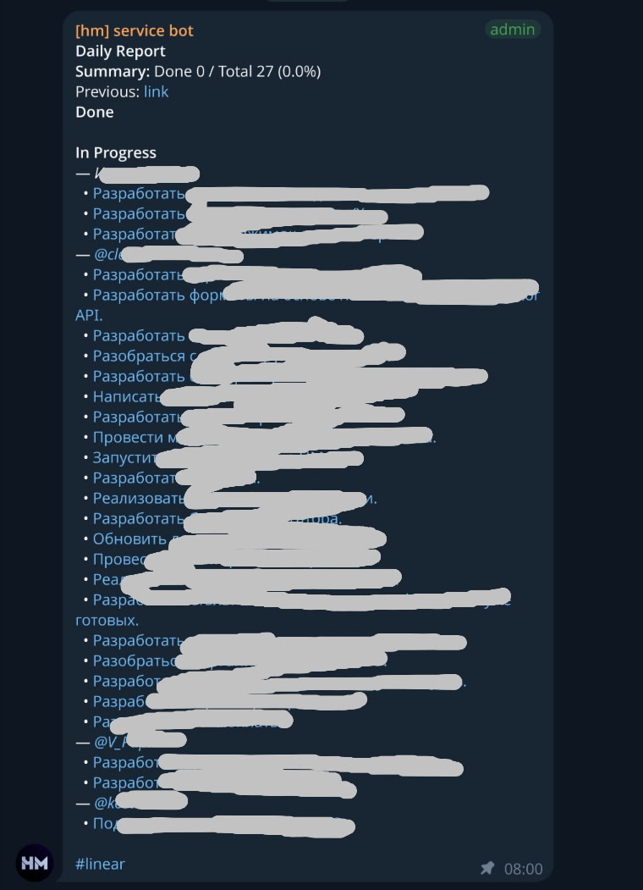
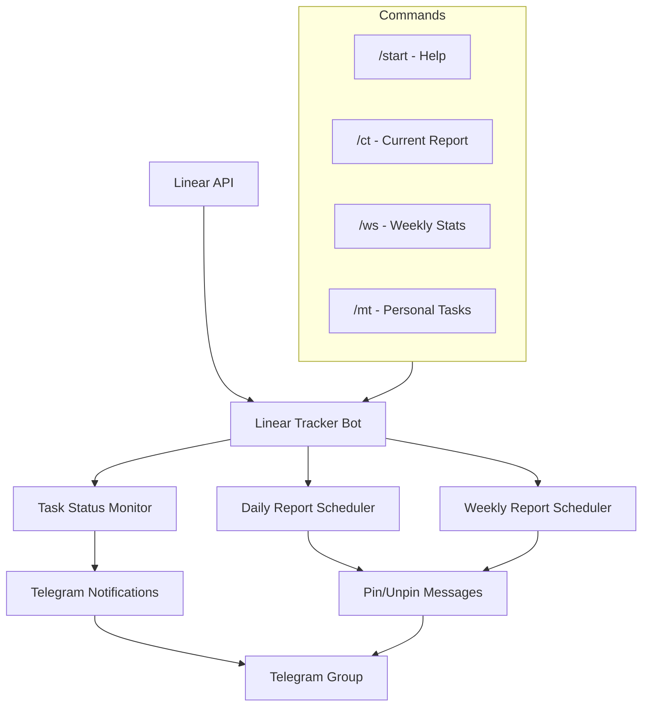

<p align="center">
  
</p>

# Linear Tracker Bot

Telegram bot for Linear notifications integration into Telegram group with automatic reports and task tracking.

**meta:** path=<bots/linear-tracker-bot> · stack=<python/aiogram> · services=<bot> · entry=<linear_bot> · ports=<n/a>

## About the Project

* Key features: 1–3 points.
  - Linear task completion and assignment notifications
  - Daily and weekly reports with automatic pinning/unpinning
  - Linear user to Telegram username mapping
* Architecture (1–2 lines): <Python bot fetches data from Linear API, scheduler creates digests and sends them to Telegram via Bot API>.

## C4



## Quick Start

1. deps: <Linux, Docker (optional), Python 3.13>
2. env: `copy example.env to .env and fill in keys`
3. install: `poetry install or pip install -r requirements.txt`
4. dev: `poetry run python -m linear_bot`
5. prod: `docker compose up -d`

## Env

```
TELEGRAM_TOKEN=...           # Bot token from @BotFather
TELEGRAM_GROUP_ID=...        # Telegram group ID
LINEAR_API_KEY=...           # Personal API token from Linear
LINEAR_TEAM_KEYS=...         # Comma-separated team keys
LINEAR_ASSIGNEE_MAP=...      # LinearUser=@telegramusername mapping
LOG_LEVEL=info               # info|debug|warn|error
```

## Commands

```
dev   : poetry run python -m linear_bot
build : docker build -t linear-tracker-bot .
lint  : poetry run black . && poetry run isort .
test  : poetry run pytest
```

## FS

```
bots/linear-tracker-bot/
├── linear_bot/              # Bot source code
├── tests/                   # Tests
├── example.env              # Example configuration
├── pyproject.toml           # Poetry dependencies/config
└── README.md                # This file
```

## Contracts / Integrations / DB

* integrations: `Linear API — data source — Personal API token`; `Telegram Bot API — notification delivery — bot token`
