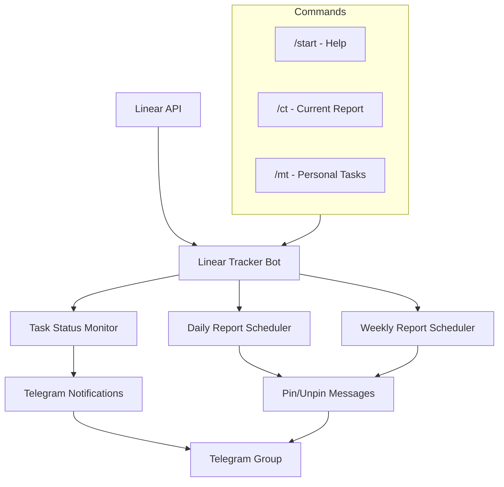

# Linear Tracker Bot

  
    
  
  
  

Telegram bot for Linear notifications integration into Telegram group with automatic reports and task tracking.

<!-- meta: path=bots/linear-tracker-bot · stack=python/aiogram · services=bot · entry=linear_bot · ports=n/a -->

## Features

- Real-time notifications on new issues, assignee changes, and task completion
- Scheduled daily reports with automatic pin/unpin of previous report
- Weekly summary reports
- Multi-chat support — route different Linear teams to different Telegram groups
- Linear user to Telegram username mapping for @mentions
- GitHub issue link detection from Linear attachments

## Bot Commands

| Command | Description |
|---------|-------------|
| `/start` | Show help and command list |
| `/ct` | Current daily report (done + in progress) |
| `/mt` | Personal tasks for the calling user |

## C4

## Quick Start

1. deps: Linux, Docker (optional), Python 3.13
2. env: `cp example.env .env` and fill in keys
3. install: `uv sync`
4. dev: `uv run python -m linear_bot`
5. prod: `docker build -t linear-tracker-bot . && docker run linear-tracker-bot`
